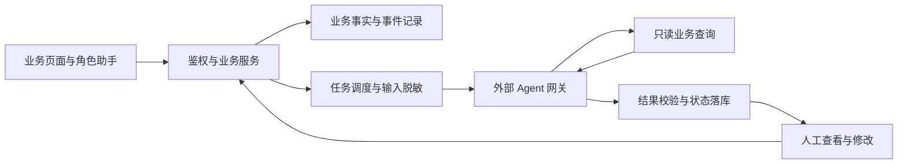

# 架构与技术决策

[项目介绍](../../README.md) · [项目案例](CASES.md) · [证据索引](FACTS.md)

## 先明确谁负责什么

应用负责业务事实与状态，模型负责理解和生成。外部网关执行一次 Agent run；业务后端提供上下文、有限查询和输出契约，再把结果交给对应页面。这样，模型不可用时仍可操作客户、审批、预约与施工流程。

| 部分 | 职责 | 选择的作用与代价 |
| --- | --- | --- |
| Vue 页面与统一 API 层 | 呈现业务状态、草稿、任务轨迹 | 操作围绕业务对象组织；权限不能仅依赖页面隐藏 |
| NestJS 业务服务 | 校验权限、对象归属和业务状态 | 规则可测试；模块间需要维护明确契约 |
| AI 调度层 | 任务登记、开关、预算、脱敏、时限与结果受理 | 接入共用执行链；需考虑失败、幂等及异步结果竞争 |
| 外部 Agent 网关 | 模型推理、事件流、工具选择 | 适配器隔离协议；运行仍依赖供应商与网关兼容性 |
| PostgreSQL 与 Prisma | 保存业务对象、任务、事件和知识 | 关系与索引明确；业务逻辑 ID 并非全部由外键强制 |

来源：[统一 HTTP 层](../../frontend/src/api/http.ts)、[业务模块](../../backend/src/modules/)、[调度服务](../../backend/src/modules/ai-dispatch/ai-dispatch.service.ts)。

## 决策一：按任务组织模型调用

任务注册表关联类型、技能、输出 Schema、时限和可选版本。提交时检查开关和日预算，对输入脱敏，创建任务后再调用网关。网关会话键以任务 ID 区分，多轮历史由业务应用显式提供。

成功结果先归一化，再通过任务 Schema 和已接入的输出规则，随后写入结果、用量与状态。超时、拒收等形成可排查的失败路径；重试另建任务，原记录保留。

该结构便于定位“哪类任务、在哪一步、因为什么失败”。代价是必须维护完整的状态和事件语义；单次任务会话隔离也不能自动解决所有浏览器账号会话问题。

来源：[注册表](../../backend/src/modules/ai-dispatch/ai-dispatch.registry.ts)、[状态机](../../backend/src/modules/ai-dispatch/ai-dispatch.states.ts)、[结果受理](../../backend/src/modules/ai-dispatch/ai-callback.service.ts)、[网关适配器](../../backend/src/modules/ai-dispatch/ws-openclaw.gateway.ts)。

## 决策二：只提供有限的业务查询工具

MCP 工具可读取总览、排期、工单和知识摘要，不提供任意 SQL 或写入业务的接口。查询限定字段与返回数量，文本出口进行脱敏，调用和超限拒绝进入后端审计。

当前计数器把调用归于最近开始的在途任务，达到代码限额后拒绝继续查询。它符合现有单实例背景；共享网关令牌尚未绑定最终用户身份，并发时归属可能偏移，不能直接扩展为多租户权限方案。

来源：[四个工具](../../backend/src/modules/ai-dispatch/store-mcp/store-mcp.tools.ts)、[MCP 控制器](../../backend/src/modules/ai-dispatch/store-mcp/store-mcp.controller.ts)、[调用计数](../../backend/src/modules/ai-dispatch/mcp-governor/mcp-call-governor.service.ts)。

## 决策三：将人工操作与模型建议分开记录

AI 原始输出保存在任务中，人工改写写入业务事件。复制和登记发送是两个不同动作，登记需要填写依据。这样可以回看原建议、人工修改和后续处理；系统不会由一次复制推断消息已经对外发送。

数据库中的关键对象：

| 对象 | 保存内容 | 关系性质 |
| --- | --- | --- |
| `Customer` / `CustomerRefId` | 客户业务信息与用于模型上下文的假名映射 | Prisma 明确定义映射关系 |
| `Lead` / `LeadEvent` | 一次客资及人工操作时间线 | 明确定义客资与事件关系 |
| `AiTask` | 输入摘要、输出、状态、用量、模型、技能版本 | 通过 refType / refId 关联业务对象，属逻辑关联 |
| `AiTaskEvent` / `AiTaskFeedback` | 状态变化及人工反馈 | 以 taskId 关联任务，当前未定义 Prisma 外键关系 |
| `KnowledgeItem` / `KnowledgeEmbedding` | 知识正文、来源、审批信息、版本和向量片段 | 向量保存 itemId / itemVersion，属逻辑关联 |
| `RoleplaySession` / `RoleplayTurn` | 模拟训练会话与回合 | Prisma 明确定义会话与回合关系 |
| `AuditLog` | 操作者、动作、对象及变更前后信息 | objectType / objectId 提供通用逻辑关联 |

来源：[schema.prisma](../../backend/prisma/schema.prisma)、[草稿服务](../../backend/src/modules/lead/ai/sales-draft.service.ts)。这些是模型定义，不包含运行数据库内容。

## 决策四：知识读取按用途分开

| 路径 | 实际实现 | 需要理解的限制 |
| --- | --- | --- |
| 独立知识问答 | 文本分块、向量检索与关键词召回，问答服务再过滤授权 | 需要 Embedding；未配置时关键词分支也不单独执行 |
| 角色对话预检索 | 标题 / 正文匹配后按相关程度组织上下文 | 生效状态过滤，当前未在此处过滤 licensed |
| MCP 知识工具 | 关键词匹配并返回脱敏摘要、来源 | 生效状态过滤，当前未在此处过滤 licensed |

这些入口复用了知识模型，但契约没有完全统一。后续完善应先核对授权与时效规则，再谈召回优化；不能把所有入口概括成相同的“安全 RAG”。

来源：[RAG](../../backend/src/modules/knowledge/rag.service.ts)、[知识问答](../../backend/src/modules/knowledge/knowledge-search.service.ts)、[AgentService](../../backend/src/modules/agent/agent.service.ts)。接线与配置细节见 [OpenClaw 说明](../../openclaw/README.md)。

## 当前取舍

单实例部署、角色路由、可观察任务与人工确认，构成当前实现范围。分布式任务身份、统一知识授权、网关运行取消和真实模型评测仍应独立推进。这里描述代码现状与取舍，不把尚未实现的改进列为个人成果。
